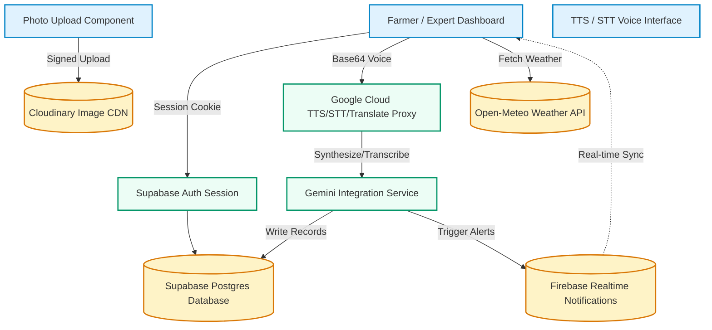
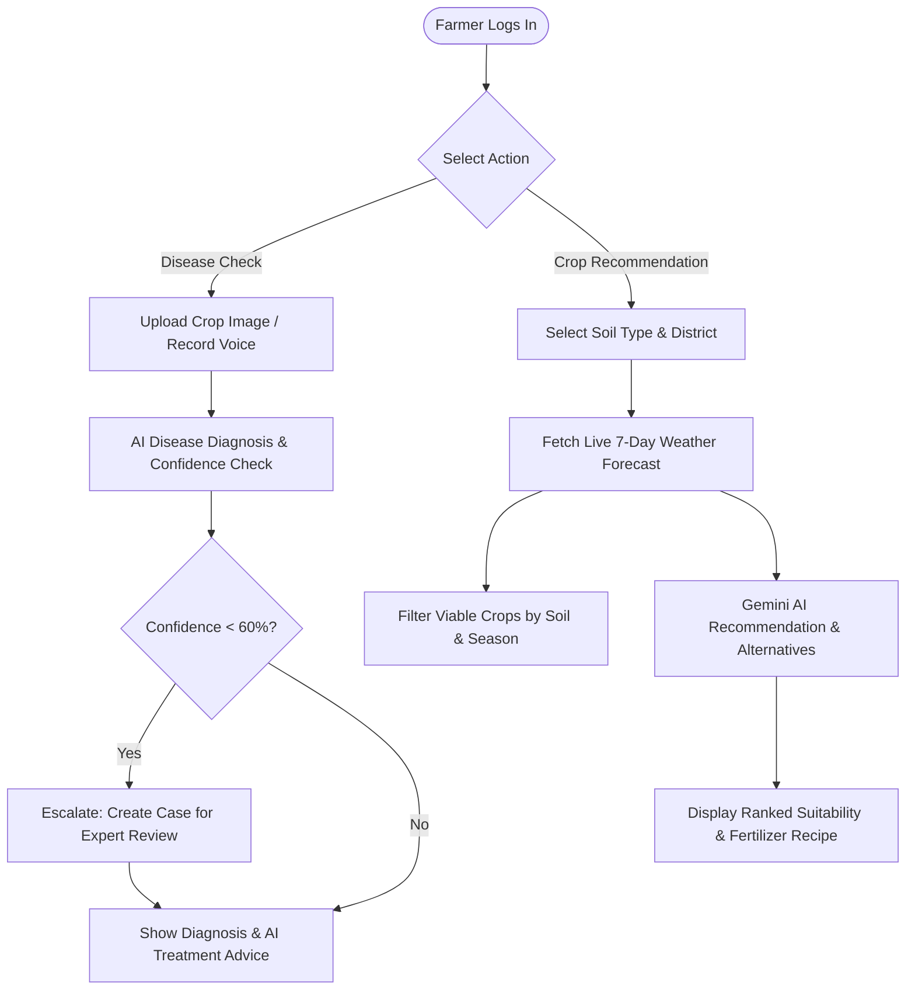
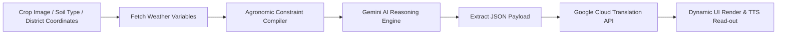
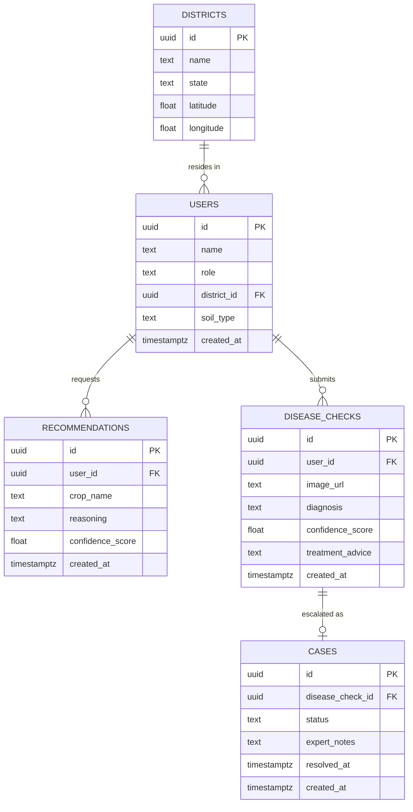

<p align="center">
  <h1 align="center">🌾 Kisan Alert</h1>
  <p align="center"><strong>AI-Powered Climate-Resilient Crop Advisory &amp; Expert Consultation Workspace</strong></p>
</p>

<p align="center">
  <a href="#-problem-statement">Problem</a> •
  <a href="#-key-features">Features</a> •
  <a href="#-system-architecture">Architecture</a> •
  <a href="#-installation--setup">Setup</a>
</p>

<p align="center">
  <!-- Frontend -->
  
  
  
  <!-- Backend / Auth -->
  
  
  <!-- AI -->
  
</p>

---

## 🚀 Live Demo

Experience the live application here:

[](https://kisan-alert-psi.vercel.app/)

Try out the following key capabilities live:
- **AI Crop Recommendation** - Get tailored suggestions based on soil and weather.
- **AI Disease Detection** - Instantly diagnose plant pathogens with Gemini Vision.
- **Expert Consultation** - Escalate complex issues to human experts in real time.
- **Multilingual Support** - Seamlessly switch between 8 Indian languages.
- **Voice Features** - Access hands-free speech-to-text and text-to-speech guidance.
- **Real-time Weather Intelligence** - Live weather metrics integrated from Open-Meteo.

---

Kisan Alert is a multilingual, climate-resilient crop advisory and expert consultation ecosystem designed to support smallholder farmers in India. It translates raw environmental signals (live weather, seasonal windows, soil attributes) and visual indicators (leaf scans) into actionable agricultural advisories, while bridging the gap between artificial intelligence and human expert validation.

Access the live deployment: **[kisan-alert-psi.vercel.app](https://kisan-alert-psi.vercel.app/)**

---

## 🗺️ Table of Contents

- [🚀 Live Demo](#-live-demo)
- [🚨 Problem Statement](#-problem-statement)
- [💡 Our Solution](#-our-solution)
- [✨ Key Features](#-key-features)
- [🏗️ System Architecture](#-system-architecture)
- [🔄 Application Flow](#-application-flow)
- [🧠 AI Pipeline](#-ai-pipeline)
- [🛠️ Tech Stack](#-tech-stack)
- [📁 Folder Structure](#-folder-structure)
- [🔌 API Documentation](#-api-documentation)
- [🗄️ Database Schema](#-database-schema)
- [🔒 Security & Verification](#-security--verification)
- [🚀 Performance Optimizations](#-performance-optimizations)
- [🌐 Accessibility](#-accessibility)
- [📥 Installation & Setup](#-installation--setup)
- [👥 Meet the Team](#-meet-the-team)

---

## 🚨 Problem Statement

Smallholder farmers in India operate on the frontlines of climate volatility, facing unpredictable rainfall, dry spells, and rapid crop disease outbreaks.

> [!IMPORTANT]
> **Why Current Solutions Fail:**
> * **Data Isolation:** Farmers consult weather tools, soil charts, and disease apps in isolation. There is no unified system connecting weather forecasts with specific soil constraints and season boundaries.
> * **The AI Trust Gap:** Purely automated AI diagnostics can misdiagnose rare crop pathogens, leading to crop loss or wasted chemical treatments.
> * **Language & Literacy Barriers:** Most digital solutions are text-heavy and only available in English or standard Hindi, excluding millions of regional-language speakers who rely on voice interface patterns.

---

## 💡 Our Solution

Kisan Alert offers a unified, safe, and collaborative climate-resilient workflow:
1. **Context-Aware Advisory:** Connects live district meteorology (Open-Meteo) with soil properties and current seasonal parameters (Kharif, Rabi, Summer) to recommend the top 3 agronomically viable crops.
2. **AI-Human Collaborative Diagnosis:** Leverages Gemini Vision for instant disease checks. If the diagnostic confidence drops below 60%, the case is automatically escalated to a regional agricultural research station (Rythu Seva Kendra) where human experts review and stamp structured prescriptions.
3. **Multilingual and Voice-First Accessibility:** Fully localized in 8 Indian languages (English, Hindi, Marathi, Gujarati, Kannada, Tamil, Telugu, and Bengali) with native speech-to-text input and natural read-aloud voice guidance.

---

## ✨ Key Features

| Feature & Icon | Core Description | Primary Technology | Farmer Benefit |
| :--- | :--- | :--- | :--- |
| **🌾 AI Crop Selector** | Recommends 3 ranked crops adjusted for soil types and season windows. | Gemini-3.1-Flash-Lite | Maximizes seasonal yields and mitigates crop failures. |
| **🔍 Disease Checker** | Identifies plant pathogens from photos or voice descriptions. | Gemini-2.5-Flash (Vision) | Instant pest/disease identification on the field. |
| **👨‍🔬 Expert Workspace** | Dedicated dashboard for scientists to review, edit, and sign off cases. | React 19 Workspace | Brings human verification to automated AI findings. |
| **💧 Moisture Estimator** | Rule-based soil moisture and vegetation index tracker driven by 7-day weather. | Open-Meteo API | Removes the need for expensive hardware sensors. |
| **🔔 Real-time Alerts** | Broadcasts push notifications for weather anomalies or expert replies. | Firebase Realtime DB | Instant warnings directly on the dashboard. |
| **🗣️ Voice Interface** | Speech-to-text input and natural read-aloud voice guidance. | Google Cloud TTS / STT | Access for semi-literate and vernacular farmers. |

---

## 🏗️ System Architecture

<details>
<summary>🛠️ Click to expand Technical Architecture Diagram</summary>


</details>

---

## 🔄 Application Flow



---

## 🧠 AI Pipeline



---

## 🛠️ Tech Stack

| Layer | Technologies Used |
| :--- | :--- |
| **Frontend Framework** | Next.js 16 (App Router), React 19, TypeScript |
| **Styling** | Tailwind CSS v4, Framer Motion (micro-animations) |
| **Database & Auth** | Supabase PostgreSQL, Row-Level Security (RLS) |
| **AI / Machine Learning** | Google Gemini (Gemini-3.1-Flash-Lite & Gemini-2.5-Flash) |
| **External APIs** | Open-Meteo API, Cloudinary (Direct Signed Uploads) |
| **Cognitive Services** | Google Cloud Translation v2, Speech-to-Text v1, Text-to-Speech v1 |
| **Notifications** | Firebase Realtime Database (REST API Integration) |

---

## 📁 Folder Structure

<details>
<summary>📂 Click to expand codebase directory structure</summary>

```
├── app/
│   ├── (auth)/                # Signup & Login routes
│   ├── api/                   # Serverless route handlers
│   │   ├── cases/             # Expert consultation case fetching & resolution
│   │   ├── dashboard/         # Aggregated weather & recommendation loader
│   │   ├── disease-checks/    # Gemini Vision analysis pipeline
│   │   ├── recommendations/   # Gemini Advisory & seasonal evaluation engine
│   │   ├── stt/               # Google Cloud Speech-to-Text proxy
│   │   ├── translate/         # Google Cloud Translation proxy
│   │   ├── tts/               # Google Cloud Text-to-Speech proxy
│   │   └── upload-signature/  # Signed short-lived Cloudinary signature
│   ├── dashboard/             # Farmer home view
│   ├── disease-check/         # Upload & AI analysis portal
│   ├── expert/                # Expert case portal & resolution workspace
│   ├── history/               # Combined historical feed timeline
│   └── recommendation/        # Dynamic crop recommendation form & wizard
├── components/                # Reusable UI components & layouts
├── contexts/                  # Language and Global states
├── hooks/                     # Custom React hooks
├── lib/                       # Services, constants, and database utilities
└── supabase/                  # Database migration schema
```
</details>

---

## 🔌 API Documentation

<details>
<summary>🔌 Click to expand Serverless Endpoints API Docs</summary>

| Method | Endpoint | Authentication | Purpose |
| :--- | :--- | :--- | :--- |
| `GET` | `/api/dashboard` | Required (Farmer) | Returns weather summary, dry-spell status, and latest recommendation. |
| `POST` | `/api/recommendations` | Required (Farmer) | Generates context-aware crop recommendation using weather and soil. |
| `POST` | `/api/disease-checks` | Required (Farmer) | Analyzes crop image or voice description via Gemini Vision. |
| `GET` | `/api/cases` | Required (Expert) | Fetches list of escalated cases pending expert evaluation. |
| `PATCH` | `/api/cases/[id]` | Required (Expert) | Updates case status, notes, and pushes real-time notification to farmer. |
| `GET` | `/api/upload-signature` | Required (Farmer) | Generates signed token for secure direct-to-Cloudinary upload. |
| `POST` | `/api/translate` | Required (User) | Translates English advisories into target languages. |
| `POST` | `/api/stt` | Required (User) | Transcribes Base64 WEBM/Opus audio to text. |
| `POST` | `/api/tts` | Required (User) | Synthesizes text to Base64 MP3 audio content. |
</details>

---

## 🗄️ Database Schema

<details>
<summary>🗄️ Click to expand Database ER Diagrams</summary>


</details>

---

## 🔒 Security & Verification

* **Authenticated Service Proxies:** Critical cloud API endpoints (`/api/stt`, `/api/tts`, `/api/translate`) are protected behind user session checks using Supabase Server-side authentication to prevent quota abuse.
* **Row-Level Security (RLS):** Enabled on all Supabase tables. Farmers can only read and insert their own crop logs, and write access is restricted.
* **Expert Boundary Protection:** Expert routes (`/api/cases`) perform backend role verification. If the authenticated session's user role is not explicitly `'expert'`, the request is immediately rejected.
* **Cloudinary Upload Signature Validation:** Rather than accepting arbitrary image URLs in `/api/disease-checks`, the backend explicitly validates the Cloudinary cloud name and hostname, rejecting unsafe path traversals or malicious URLs.
* **Sanitized Logs:** Production console logs are sanitised and guarded behind the `isDev` flag to protect user privacy (PII) in log streams.

---

## 🚀 Performance Optimizations

> [!TIP]
> **How we keep the application fast and reliable:**
> * **Client-Side Image Pre-compression:** Images are scaled (max 1280px edge) and compressed to JPEG format directly on the device using HTML5 Canvas APIs *before* transmission, reducing bandwidth overhead.
> * **Concurrent API Requests:** Fetches current weather forecasts, user history, and Gemini outputs in parallel using `Promise.all` handlers on Route Handlers.
> * **Static and Dynamic Segmentation:** Prerenders landing pages statically while dynamically serving dashboard interfaces to ensure immediate load times.

---

## 🌐 Accessibility

* **Local Languages:** 100% translation support across English, Hindi, Marathi, Gujarati, Kannada, Tamil, Telugu, and Bengali.
* **Voice Assistance:** TTS (Text-to-Speech) capabilities read treatment steps, recovery times, and recommendations aloud, which is critical for hands-busy or low-literacy farmers.
* **Mobile-First Responsive Interface:** Swaps fluidly from a side-by-side split screen on desktop to a single-column layout on mobile, keeping buttons easily clickable.

---

## 📥 Installation & Setup

<details>
<summary>💻 Click to expand Developer Setup and Running Instructions</summary>

### Prerequisites
* [Node.js](https://nodejs.org/) v18 or later
* A [Supabase](https://supabase.com/) project (PostgreSQL database)
* A [Google Cloud Console](https://console.cloud.google.com/) account with Cloud Speech, Cloud Text-to-Speech, and Translation APIs enabled
* A Google AI Studio API key (for Gemini)
* A [Cloudinary](https://cloudinary.com/) account for image uploads

### 1. Environment Setup
Clone the repository and copy the environment template:
```bash
cp .env.example .env.local
```
Fill in the keys in `.env.local`:
```env
NEXT_PUBLIC_SUPABASE_URL=https://your-project.supabase.co
NEXT_PUBLIC_SUPABASE_ANON_KEY=your-anon-key
GEMINI_API_KEY=your-gemini-key
CLOUDINARY_CLOUD_NAME=your-cloud-name
CLOUDINARY_API_KEY=your-api-key
CLOUDINARY_API_SECRET=your-api-secret
NEXT_PUBLIC_CLOUDINARY_CLOUD_NAME=your-cloud-name
GOOGLE_CLOUD_API_KEY=your-google-cloud-api-key
NEXT_PUBLIC_FIREBASE_API_KEY=your-firebase-key
NEXT_PUBLIC_FIREBASE_PROJECT_ID=your-firebase-project-id
NEXT_PUBLIC_FIREBASE_DATABASE_URL=https://your-database.firebaseio.com
```

### 2. Database Schema
Execute the schema script in the **Supabase SQL Editor** to construct the tables, check constraints, and set up Row-Level Security (RLS) policies:
```sql
-- Paste and run the contents of:
supabase/schema.sql
```

### 3. Local Development
Install dependencies and run the development server:
```bash
npm install
npm run dev
```
Open [http://localhost:3000](http://localhost:3000) to view the application.

*Alternatively, you can access the live deployed platform directly at **[kisan-alert-psi.vercel.app](https://kisan-alert-psi.vercel.app/)**.*
</details>

---

## 👥 Meet the Team

### 👨‍💻 Brijesh Makwana — Project Lead
* **Responsibilities:** Full Stack Next.js Development, Gemini AI & Vision integration, Supabase Database design, Expert Workspace features, Production deployment, and Project management.

### 👨‍💻 Gaurav Sharma — Full Stack Developer
* **Responsibilities:** Frontend Development, API Integration (Open-Meteo & Google Cloud Proxies), Feature implementation, testing, QA, and UI/UX optimization.

---

## 📄 License

This project is licensed under the MIT License - see the [LICENSE](LICENSE) file for details.

